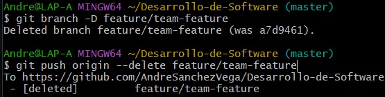

# Preguntas
## 1) ¿Cómo te ha ayudado Git a mantener un historial claro y organizado de tus cambios?
-Git me ha ayudado un montón a mantener un historial organizado de mis cambios porque me permite hacer commits cada vez que realizo una modificación importante en mis proyectos. Así puedo volver fácilmente a una versión anterior si algo sale mal. Además, puedo ver qué cambios hice, cuándo los hice y por qué, lo que hace que todo esté claro y fácil de seguir, sobre todo cuando colaboro con otros.
## 2) ¿Qué beneficios ves en el uso de ramas para desarrollar nuevas características o corregir errores?
El uso de ramas es super útil porque me permite trabajar en nuevas características o corregir errores sin afectar la versión principal del proyecto. Puedo probar cosas nuevas o hacer cambios sin miedo a romper algo que ya está funcionando. Y si todo sale bien, puedo fusionar la rama con la principal sin problemas. Además, si estoy trabajando en equipo, cada quien puede tener su propia rama y así evitar conflictos.
## 3) Realizar una revisión final del historial de commits para asegurarte de que todos los cambios se han registrado correctamente.
-Mediante el comando git log --oneline visualiza específicamente los commits junto al mensaje proporcionado.

## 4) Revisa el uso de ramas y fusiones para ver cómo Git maneja múltiples líneas de desarrollo.
-Con el uso del comando git log --graph logro verificar los commits y sus respectivas ramas creadas.

# Ejercicios

## Ejercicio 1: Manejo avanzado de ramas y resolución de conflictos
**Objetivo:** Practicar la creación, fusión y eliminación de ramas, así como la resolución de conflictos que puedan surgir durante la fusión.

### Instrucciones:

#### 1. Crear una nueva rama para una característica:

Crea una nueva rama llamada `feature/advanced-feature` desde la rama `main`:

#### 2. Modificar archivos en la nueva rama:
Edite el archivo main.pypara incluir una función adicional y agregue y confirme estos cambios en la rama feature/advanced-feature:

#### 3. Simular un desarrollo paralelo en la rama principal:
Cambia de nuevo a la rama main, edite el archivo main.pyde forma diferente (por ejemplo, cambie el mensaje del original impreso), y 
agregue y confirme estos cambios en la rama main:

#### 4. Intentar fusionar la rama feature/advanced-feature en main:
Fusiona la rama feature/advanced-featureen main:

#### 5. Resolver el conflicto de fusión:
Git generará un conflicto en main.py. Abra el archivo y resuelve el conflicto manualmente, eligiendo cómo combinar las dos versiones.

Después de resolver el conflicto, añade el archivo resuelto y completa la fusión:

#### 6. Eliminar la rama fusionada:
Una vez que hayas fusionado con éxito y resuelto los conflictos, elimina la rama feature/advanced-feature:

## Ejercicio 2: Exploración y manipulación del historial de commits
### Instrucciones:
#### 1. Ver el historial detallado de commits:
Usa el comando git logpara explorar el historial de commits, pero esta vez con más detalle:

#### 2. Filtrar commits por autor:

Usa el siguiente comando para mostrar solo los commits realizados por un autor específico:

#### 3. Revertir un compromiso:
Imagina que el compromiso más reciente en main.pyno debería haberse hecho. Usa git revertpara revertir ese compromiso:

#### 4. Rebase interactivo:
Realiza una rebase interactiva para combinar varios commits en uno solo. Esto es útil para limpiar el historial de confirmaciones antes de una fusión.

Usa el siguiente comando para empezar el rebase interactivo:

#### 5. Visualización gráfica del historial:
Usa el siguiente comando para ver una representación gráfica del historial de confirmaciones:

## Ejercicio 3: Creación y gestión de ramas desde commits específicos
**Objetivo:** Practicar la creación de ramas desde commits específicos y comprender cómo Git maneja las referencias históricas
### Instrucciones:
#### 1. Crear una nueva rama desde un commit específico:
Usa el historial de commits ( git log --oneline) para identificar un commit antiguo desde el cual crear una nueva rama:

Crea una nueva rama bugfix/rollback-featuredesde ese commit:

#### 2. Modificar y confirmar cambios en la nueva rama:
Realice algunas modificaciones en main.pyque simultáneamente una corrección de errores, agregue y confirme los cambios en la nueva rama:

#### 3. Fusionar los cambios en la rama principal:
Cambia de nuevo a la rama mainy fusiona la rama bugfix/rollback-feature:

#### 4. Explorar el historial después de la fusión:
Usa git logy git log --graphpara ver cómo se ha integrado el commit en el historial:

#### 5. Eliminar la rama corrección de errores/función de reversión:
Una vez fusionados los cambios, elimina la rama bugfix/rollback-feature:

## Ejercicio 4: Manipulación y restauración de commits con git reset y git restablecimiento
**Objetivo:** Comprender cómo usar git resety git restorepara deshacer cambios en el historial y en el área de trabajo.

### Instrucciones:

#### 1. Hacer cambios en el archivo main.py:
Edite el archivo main.pypara introducir un nuevo cambio:
print('This change will be reset')
Agregue y confirme los cambios:

#### 2. Usar git reset para deshacer el commit:

Deshaz el commit utilizando git resetpara volver al estado anterior:

#### 3.Usar git recovery para deshacer cambios no confirmados:
Realiza un cambio en README.mdy no lo confirma, usa git restorepara deshacer este cambio no confirmado:

## Ejercicio 5: Trabajo colaborativo y manejo de Pull Requests
**Objetivo:** Simular un flujo de trabajo colaborativo utilizando ramas y pull request.

### Instrucciones:
#### 1.Crear un nuevo repositorio remoto:
Usa GitHub o GitLab para crear un nuevo repositorio remoto y clonarlo localmente:

#### 2. Crear una nueva rama para desarrollo de una característica:
En tu repositorio local, crea una nueva rama feature/team-feature:

#### 3. Realizar cambios y enviar la rama al repositorio remoto:
Realiza cambios en los archivos del proyecto y confirmalos:

Envía la rama al repositorio remoto:

#### 4. Abrir una solicitud de extracción:
Abra un Pull Request (PR) en la plataforma remota (GitHub/GitLab) para fusionar feature/team-featurecon la rama main.
Agregue una descripción detallada del PR, explicando los cambios realizados y su propósito.

#### 5.Revisar y fusionar el Pull Request:
Simula la revisión de código, comenta en el PR y realiza cualquier cambio necesario basado en la retroalimentación.
Una vez aprobado, fusiona el PR en la rama main.

#### 6.Eliminar la rama remota y local:
Después de la fusión, elimine la rama tanto local como remotamente:

