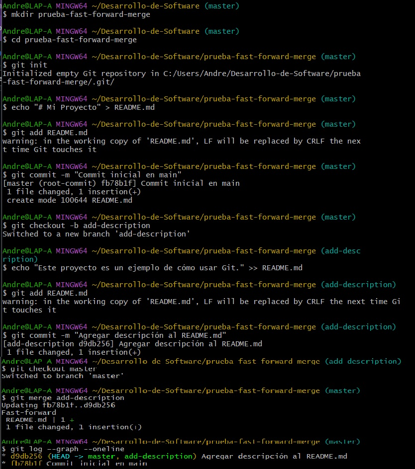
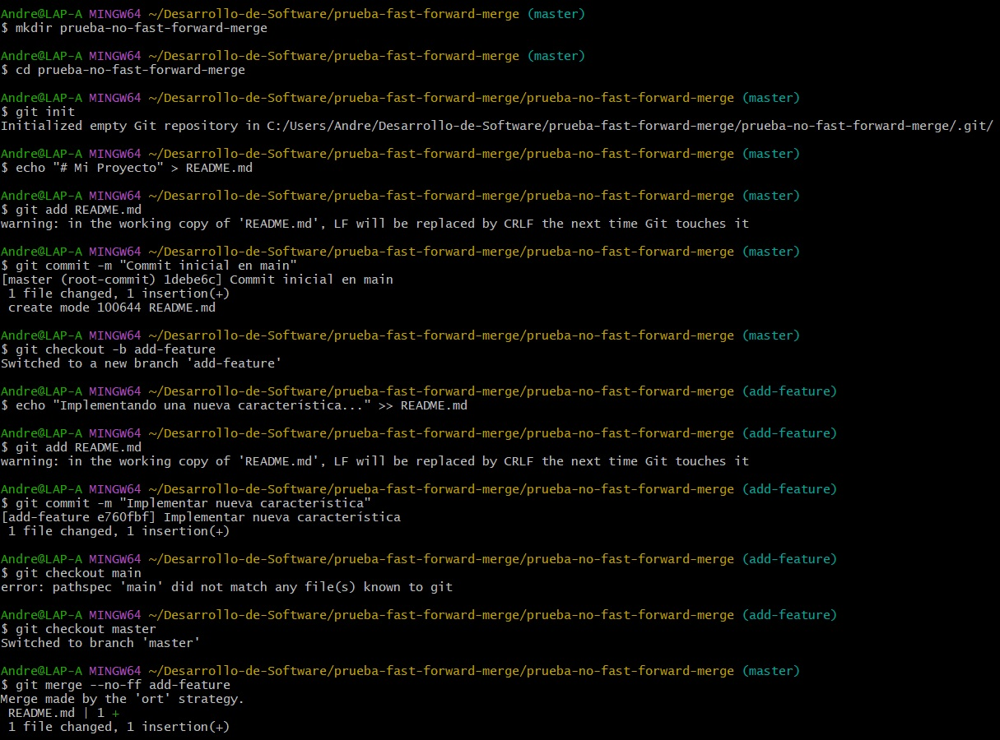
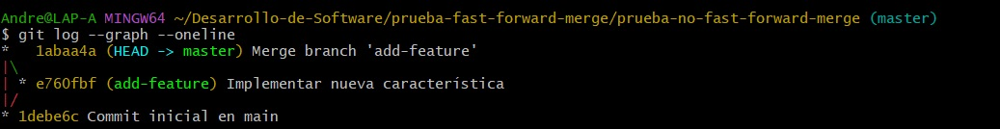

# Ejemplos
## 1. Fusión Avance rápido (git merge --ff)
La fusión de avance rápido es la forma más sencilla de combinar ramas en Git. Solo es posible cuando la rama base no ha recibido nuevos commits desde que se creó la rama feature.

#### Pasos prácticos:
```bash
# Crear un nuevo repositorio
$ mkdir prueba-fast-forward-merge
$ cd prueba-fast-forward-merge
$ git init

# Agregar un archivo inicial en la rama principal (main)
$ echo "# Mi Proyecto" > README.md
$ git add README.md
$ git commit -m "Commit inicial en main"

# Crear y cambiar a una nueva rama 'add-description'
$ git checkout -b add-description

# Hacer cambios en la nueva rama y comitearlos
$ echo "Este proyecto es un ejemplo de cómo usar Git." >> README.md
$ git add README.md
$ git commit -m "Agregar descripción al README.md"
```
#### Pregunta:
Muestra la estructura de commits resultante.

```bash
# Cambiar de vuelta a la rama 'main' y realizar la fusión fast-forward
$ git checkout main
$ git merge add-description

# Ver el historial lineal
$ git log --graph --oneline
```
#### Resultado


## 2. Fusión No-avance rápido (git merge --no-ff)
La fusión no-fast-forward crea un nuevo compromiso de fusión. Es útil para preservar el contexto de la fusión, especialmente en equipos donde se requiere más claridad en el historial de cambios.

#### Pasos prácticos:
```bash
# Crear un nuevo repositorio
$ mkdir prueba-no-fast-forward-merge
$ cd prueba-no-fast-forward-merge
$ git init

# Agregar un archivo inicial en la rama principal (main)
$ echo "# Mi Proyecto" > README.md
$ git add README.md
$ git commit -m "Commit inicial en main"

# Crear y cambiar a una nueva rama 'add-feature'
$ git checkout -b add-feature

# Hacer cambios en la nueva rama y comitearlos
$ echo "Implementando una nueva característica..." >> README.md
$ git add README.md
$ git commit -m "Implementar nueva característica"
```
#### Pregunta:
Muestra el registro de confirmaciones resultantes.

```bash
# Cambiar de vuelta a la rama 'main' y realizar una fusión no-fast-forward
$ git checkout main
$ git merge --no-ff add-feature
```
Después de la edición, veamos el log ahora:

```bash
# Ver el historial
$ git log --graph --oneline
```
El historial de tu repositorio mostrará un compromiso de fusión.
#### Resultado






