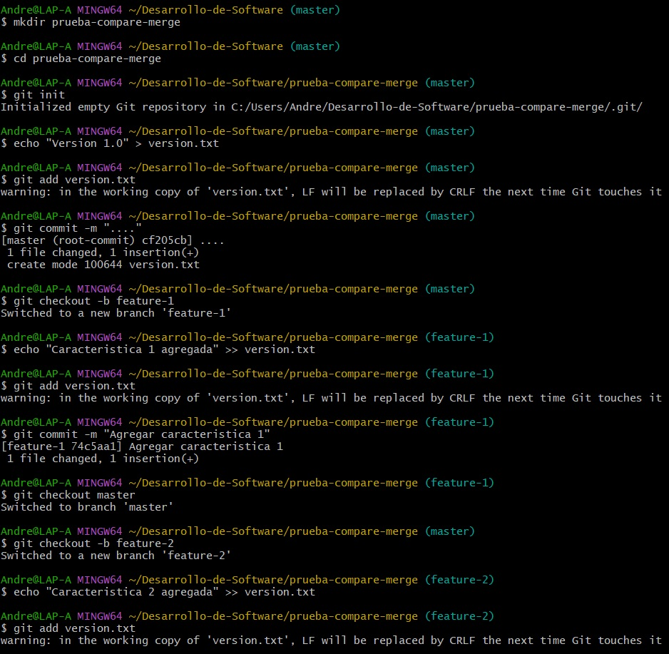

# Ejemplos
## 1. Fusión Avance rápido (git merge --ff)
La fusión de avance rápido es la forma más sencilla de combinar ramas en Git. Solo es posible cuando la rama base no ha recibido nuevos commits desde que se creó la rama feature.

#### Pasos prácticos:
```bash
# Crear un nuevo repositorio
$ mkdir prueba-fast-forward-merge
$ cd prueba-fast-forward-merge
$ git init

# Agregar un archivo inicial en la rama principal (main)
$ echo "# Mi Proyecto" > README.md
$ git add README.md
$ git commit -m "Commit inicial en main"

# Crear y cambiar a una nueva rama 'add-description'
$ git checkout -b add-description

# Hacer cambios en la nueva rama y comitearlos
$ echo "Este proyecto es un ejemplo de cómo usar Git." >> README.md
$ git add README.md
$ git commit -m "Agregar descripción al README.md"
```
#### Pregunta:
Muestra la estructura de commits resultante.

```bash
# Cambiar de vuelta a la rama 'main' y realizar la fusión fast-forward
$ git checkout main
$ git merge add-description

# Ver el historial lineal
$ git log --graph --oneline
```
#### Resultado


## 2. Fusión No-avance rápido (git merge --no-ff)
La fusión no-fast-forward crea un nuevo compromiso de fusión. Es útil para preservar el contexto de la fusión, especialmente en equipos donde se requiere más claridad en el historial de cambios.

#### Pasos prácticos:
```bash
# Crear un nuevo repositorio
$ mkdir prueba-no-fast-forward-merge
$ cd prueba-no-fast-forward-merge
$ git init

# Agregar un archivo inicial en la rama principal (main)
$ echo "# Mi Proyecto" > README.md
$ git add README.md
$ git commit -m "Commit inicial en main"

# Crear y cambiar a una nueva rama 'add-feature'
$ git checkout -b add-feature

# Hacer cambios en la nueva rama y comitearlos
$ echo "Implementando una nueva característica..." >> README.md
$ git add README.md
$ git commit -m "Implementar nueva característica"
```
#### Pregunta:
Muestra el registro de confirmaciones resultantes.

```bash
# Cambiar de vuelta a la rama 'main' y realizar una fusión no-fast-forward
$ git checkout main
$ git merge --no-ff add-feature
```
Después de la edición, veamos el log ahora:

```bash
# Ver el historial
$ git log --graph --oneline
```
El historial de tu repositorio mostrará un compromiso de fusión.
#### Resultado


## 3. Fusionar squash (git merge --squash)
La fusión squash combina todos los cambios de una rama en un solo commit en la rama principal. Este método es útil cuando se quiere mantener limpio un historial de confirmaciones.

#### Pasos prácticos:
```bash
# Crear un nuevo repositorio
$ mkdir prueba-squash-merge
$ cd prueba-squash-merge
$ git init

# Agregar un archivo inicial en la rama principal (main)
$ echo "# Mi Proyecto" > README.md
$ git add README.md
$ git commit -m "Commit inicial en main"

# Crear y cambiar a una nueva rama 'add-basic-files'
$ git checkout -b add-basic-files

# Hacer algunos cambios y comitearlos
$ echo "# CÓMO CONTRIBUIR" >> CONTRIBUTING.md
$ git add CONTRIBUTING.md
$ git commit -m "Agregar CONTRIBUTING.md"

$ echo "# LICENCIA" >> LICENSE.txt
$ git add LICENSE.txt
$ git commit -m "Agregar LICENSE.txt"
```
#### Pregunta:
¿Cuál es tu estructura de commits?

```bash
# Cambiar de vuelta a la rama 'main' y realizar la fusión squash
$ git checkout main
$ git merge --squash add-basic-files
```

Los commits luego se aplastan y se convierten en un solo commit:

Para completar la fusión squash, realiza un commit:

```bash
$ git add .
$ git commit -m "Agregar documentación estándar del repositorio"
$ git log --graph --oneline
```

Esto combinará todos los cambios de la rama add-multiple-features en un solo nuevo commit en la rama main.

#### Resultado


# Ejercicios
## Resolver conflictos en una fusión sin avance rápido
En algunos casos, las fusiones no son tan sencillas y pueden surgir conflictos que necesitas resolver manualmente. Este ejercicio te guiará a través del proceso de manejo de conflictos.

1.Inicializa un nuevo repositorio:

```bash
mkdir prueba-merge-conflict
cd prueba-merge-conflict
git init
```

2.Crea un archivo index.html y realiza un commit en la rama principal:

```bash
echo "<html><body><h1>Proyecto inicial CC3S2</h1></body></html>" > index.html
git add index.html
git commit -m "commit inicial del  index.html en main"
```

3.Crea y cambia a una nueva rama de actualización de funciones:
```bash
git checkout -b feature-update
```

4.Edita el archivo y realiza un commit en la rama feature-update:

```bash
echo "<p>.....</p>" >> index.html
git add index.html
git commit -m "Actualiza ..."
```

5.Regresa a la rama principal y realiza una edición en el mismo archivo:

```bash
git checkout main
echo "<footer>Contacta aquí example@example.com</footer>" >> index.html
git add index.html
git commit -m "....index.html"
```

6.Fusiona la rama feature-update con --no-ff y observa el conflicto:

```bash
git merge --no-ff feature-update
```

7.Git detectará un conflicto en index.html. Abra el archivo y resuelva el conflicto. Elimina las líneas de conflicto generadas por Git ( <<<<<<<, =======, >>>>>>>) y crea la versión final del archivo con ambos cambios:

```bash
<html>
  <body>
    <h1>....</h1>
    <p>....</p>
    <footer>...example@example.com</footer>
  </body>
</html>
```

8.Agrega el archivo corregido y completa la fusión:

```bash
git add index.html
git commit
```

9.Verifica el historial para confirmar la fusión y el compromiso de resolución de conflicto:

```bash
git log --graph --oneline
```

#### Preguntas 

##### ¿Qué pasos adicionales tuviste que tomar para resolver el conflicto?

Lo que hice fue abrir index.html manualmente, localicé las marcas <<<<<<<, =======, >>>>>>>, elegí y combiné las secciones deseadas, y borré esas marcas.

Guardé el archivo, comprobé con git status que el conflicto quedó resuelto, añadí git add index.html y ejecuté git commit para cerrar la fusión.

##### ¿Qué estrategias podrías emplear para evitar conflictos en futuros desarrollos colaborativos?
-Sincronizarnos con git pull --rebase o git fetch + rebase antes de empezar a trabajar.
-También podemos dividir las tareas en ramas pequeñas y de vida corta, y fusionarlas con rapidez.
-Establecer convenciones claras de edición (formato, estructura de archivo) y comunicación continua entre el equipo.
-Usar revisiones de código (pull requests) para detectar solapamientos antes de fusionar.

## Comparar los historiales con git log después de diferentes fusiones

Este ejercicio te permitirá observar las diferencias en el historial generado por fusiones fast-forward, non-fast-forward y squash.

### Pasos
1.Crea un nuevo repositorio y realiza varios commits en dos ramas:

```bash
mkdir prueba-compare-merge
cd prueba-compare-merge
git init
echo "Version 1.0" > version.txt
git add version.txt
git commit -m "...."
git checkout -b feature-1
echo "Caracteristica 1 agregada" >> version.txt
git add version.txt
git commit -m "Agregar caracteristica 1"
git checkout main
git checkout -b feature-2
echo "Caracteristica 2 agregada" >> version.txt
git add version.txt
git commit -m "Se agrega caracteristica 2"
```

2.Función Fusiona-1 usando avance rápido:

```bash
git checkout main
git merge feature-1 --ff
```

3.Función Fusiona 2 usando avance no rápido:

```bash
git merge feature-2 --no-ff
```

4.Realiza una nueva rama feature-3 con Múltiples commits y fusiónala con squash:

```bash
git checkout -b feature-3
echo "Caracteristica 3 paso 1" >> version.txt
git add version.txt
git commit -m "Caracteristica 3 paso 1"
echo "Caracteristica 3 paso 2" >> version.txt
git add version.txt
git commit -m "Caracteristica 3 paso 2"
git checkout main
git merge --squash feature-3
git commit -m "Agregar caracteristica 3 en un commit"
```
5.Compara el historial de Git:

Avance rápido histórico:
```bash
git log --graph --oneline --merges --first-parent –branches
```
Historial sin avance rápido:
```bash
git log --graph --oneline –merges
```
Historia del Squash:

```bash
git log --graph --oneline --merges --decorate --all
```



#### Preguntas
##### ¿Cómo se ve el historial en cada tipo de fusión?


